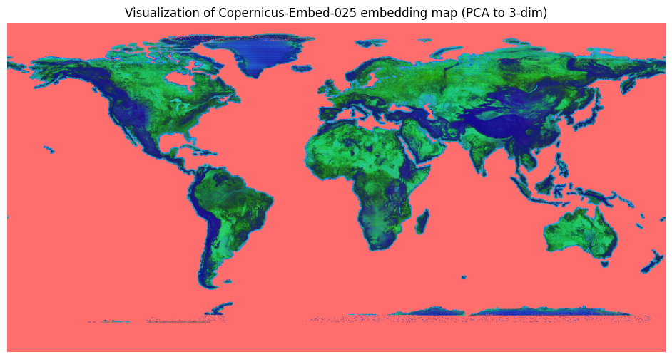

# Copernicus-Embed-025

[](https://opensource.org/licenses/Apache-2.0)
[](https://arxiv.org/abs/2503.11849)
[](https://huggingface.co/datasets/wangyi111/Copernicus-Pretrain)

This directory contains information for the climate experiments in the paper "Towards a Unified Copernicus Foundation Model for Earth Vision", as well as an extended embedding dataset **Copernicus-Embed-025**. Originally, 10K 0.25x0.25 grids (with all 8 modalities) are sampled from the Copernicus-Pretrain dataset and encoded using the Copernicus-FM model to get image embeddings for each modality. The embeddings are averaged over different modalities to get one embedding vector for each grid, and later used for the climate prediction tasks to investigate the potential of briding EO and climate. As a follow-up, we extend the embeddings to the whole globe using the full Copernicus-Pretrain dataset, making it possible to construct a "embedding map" (721x1440xD, filling ocean grids with 0) to add to the static variables in ERA5, potentially helping weather/climate models.

## Bridging EO and climate via grid embeddings

- [ ] To be updated.

## Extended embedding dataset: Copernicus-Embed-025

Copernicus-Embed-025 is an embedding dataset that gives each 0.25x0.25 grid one embedding vector, aggregrated over all available modalities from the Copernicus-Pretrain dataset.



### Dataset structure

The whole dataset files are organized as follows:

```bash
Copernicus-Embed-025
├── grid_embeddings
│   ├── full_chunks # embeddings for each modality for each grid
│   │   ├── 220k_aligned
│   │   │   ├── embeddings_220k_chunk_0.parquet # rows of [grid_id_coord, modality, local_id_coord, date, embedding]
│   │   │   ├── ...
│   │   ├── 220k_310k_union
│   │   │   ├── embeddings_220k_310k_chunk_0.parquet # rows of [grid_id_coord, modality, local_id_coord, date, embedding]
│   │   │   ├── ...
│   ├── avg_chunks # averaged embeddings for each grid
│   │   ├── embeddings_avg_220k_aligned.parquet # rows of [grid_id_coord, embedding]
│   │   ├── embeddings_avg_220k_310k_union.parquet # rows of [grid_id_coord, embedding]
│   │   ├── embeddings_avg_310k.parquet # rows of [grid_id_coord, embedding], merging the above two
│   ├── embed_map_310k.npz/pt # aggregated embedding map, 721x1440x768 (0 for grids not in Copernicus-Pretrain, mostly ocean)
|   ├── grid_0_25_globe_pix.parquet # mapping grid geometry to pixel coordinates in embedding map
```

`embed_map_310k.npz/pt` can be conveniently used to enrich the static variables in ERA5 (maybe after dim reduction), or as additional input sources for weather/climate models.

### Dataset access

The embedding datasets are available on [HuggingFace](https://huggingface.co/datasets/wangyi111/Copernicus-Pretrain).

### Dataset usage

A simple example to load the embedding map is as follows:

```python
# download the embedding map
# !wget https://huggingface.co/datasets/wangyi111/Copernicus-Pretrain/resolve/main/grid_embeddings/embed_map_310k.npz -P data/
import numpy as np
# load the embedding map
embed_map = np.load('data/embed_map_310k.npz')
# extract the embeddings
embed_map = embed_map['arr_0']

print(embed_map.shape) # (721, 1440, 768)
```

`demo_embed_map.ipynb` provides a demo notebok visualizing the embedding map.

## License

This directory is licensed under the Apache License 2.0. The Copernicus-Embed-025 dataset is licensed under the CC-BY-4.0 license.

## Citation

```bibtex
@misc{wang2025unifiedcopernicusfoundationmodel,
      title={Towards a Unified Copernicus Foundation Model for Earth Vision}, 
      author={Yi Wang and Zhitong Xiong and Chenying Liu and Adam J. Stewart and Thomas Dujardin and Nikolaos Ioannis Bountos and Angelos Zavras and Franziska Gerken and Ioannis Papoutsis and Laura Leal-Taixé and Xiao Xiang Zhu},
      year={2025},
      eprint={2503.11849},
      archivePrefix={arXiv},
      primaryClass={cs.CV},
      url={https://arxiv.org/abs/2503.11849}, 
}
```