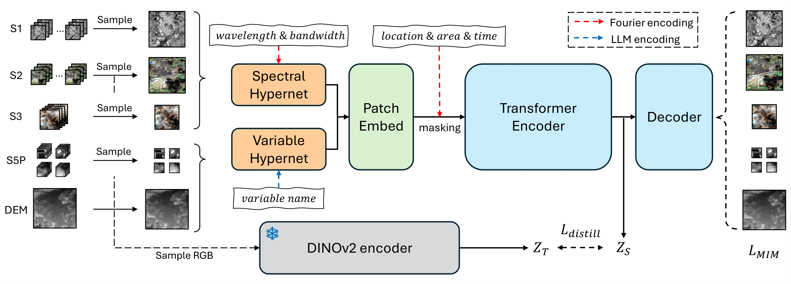

# Copernicus-FM

[](https://opensource.org/licenses/Apache-2.0)
[](https://arxiv.org/abs/2503.11849)

This directory contains the official implementation for the multimodal foundation model **Copernicus-FM** in the paper "Towards a Unified Copernicus Foundation Model for Earth Vision".

## Model Overview



Copernicus-FM is an extension of the [DOFA](https://github.com/zhu-xlab/DOFA) foundation model, able to process any spectral or non-spectral sensor modality using extended dynamic hypernetworks and flexible metadata encoding. The model is pretrained on the Copernicus-Pretrain dataset with masked image modeling and continual distillation.

### Key features

- **A unified model for any spectral / non-spectral modality** -- dynamic hypernetworks with Fourier / language encoding
- **Efficient processing of any spatial resolution** -- adaptive patch embedding kernel size
- **Flexible metadata integration** -- Fourier encoding with learnable meta tokens

### Pretrained weights

The model weights are available on [HuggingFace](https://huggingface.co/wangyi111/Copernicus-FM).

| Model | download |
| :---: | :---: |
| ViT-B/16 | [backbone](https://huggingface.co/wangyi111/Copernicus-FM/resolve/main/CopernicusFM_ViT_base_varlang_e100.pth) |
| ... | ... |

## Pretraining

- [ ] To be updated soon.

## Using the pretrained model

First, download the pretrained weights:

```bash
mkdir -p ./weights/
wget https://huggingface.co/wangyi111/Copernicus-FM/resolve/main/CopernicusFM_ViT_base_varlang_e100.pth -P ./weights/
```

For quick setup of the dependencies, run the following commands:

```bash
conda create -n copernicusfm python=3.10
conda activate copernicusfm
pip install torch torchvision timm einops rasterio pyproj # or pip install -r requirements.txt

```

Then, open a Python interpreter and run:

```python
import torch
from src.model_vit import vit_base_patch16

# create model
model = vit_base_patch16(num_classes=10, global_pool=False)

# load pre-trained weights
path = './weights/CopernicusFM_ViT_base_varlang_e100.pth'
check_point = torch.load(path)
if 'model' in check_point:
    state_dict = check_point['model']
else:
    state_dict = check_point
msg = model.load_state_dict(state_dict, strict=False)
print(msg)

# encode an image
## Spectral input: any stack of spectral bands
img = torch.randn(1, 4, 224, 224)
meta = torch.full((1, 4), float('nan')) # [lon, lat, delta_time, patch_token_area], assume unknown
wvs = [490, 560, 665, 842] # wavelength: B,G,R,NIR (Sentinel 2)
bws = [65, 35, 30, 115] # bandwidth: B,G,R,NIR (Sentinel 2)
language_embed = None # N/A
kernel_size = 16 # expected patch size
input_mode = 'spectral'

print('Encoding a spectral image with shape {}, and expected patch size {}.'.format(img.shape, kernel_size))
logit, embed = model(img, meta, wvs, bws, language_embed, input_mode, kernel_size)
print(logit.shape, embed.shape)
```

The above code snippet demonstrates how to load the pretrained weights and encode a spectral image with the Copernicus-FM model. The `embed` tensor contains the encoded image features, which can be used for downstream tasks. Similarly, you can encode a non-spectral image with the following code:

```python
## Non-spectral input: any image with a variable name
# example: pre-defined variable in Copernicus-FM (s5p_no2, s5p_co, s5p_o3, s5p_so2, dem)
var_name = 'Sentinel 5P Nitrogen Dioxide' # to index the predefined language embedding
img = torch.randn(1, 1, 56, 56)
meta = torch.full((1, 4), float('nan')) # [lon, lat, delta_time, patch_token_area], assume unknown
wvs = None # not used
bws = None # not used
language_embed = None # s5p_no2 is predefined in the model
kernel_size = 4 # expected patch size
input_mode = 'variable'

# get a language embedding for the variable name
var_embed_fpath = './weights/var_embed_llama3.2_1B.pt'
if not os.path.exists(var_embed_fpath):
    url = 'https://huggingface.co/wangyi111/Copernicus-FM/resolve/main/varname_embed/varname_embed_llama3.2_1B.pt'
    # pre-defined variable embeddings, encoded with Llama3.2-1B
    download_url(url, './weights/', filename='var_embed_llama3.2_1B.pt')
language_embed = torch.load('./weights/var_embed_llama3.2_1B.pt') # 2048   
language_embed = language_embed[var_name]


print('Encoding a variable image with name "{}", shape {}, and expected patch size {}.'.format(var_name, img.shape, kernel_size))
logit, embed = model(img, meta, wvs, bws, language_embed, input_mode, kernel_size)
print(logit.shape, embed.shape)
```

Check [demo.ipynb](demo.ipynb) for detailed examples.

- [ ] TODO: Add more demonstration.

## License

This directory is licensed under the Apache License 2.0, with portions of third-party code licensed under the MIT License. The model weights are licensed under the CC-BY-4.0 license.

## Citation

```bibtex
@misc{wang2025unifiedcopernicusfoundationmodel,
      title={Towards a Unified Copernicus Foundation Model for Earth Vision}, 
      author={Yi Wang and Zhitong Xiong and Chenying Liu and Adam J. Stewart and Thomas Dujardin and Nikolaos Ioannis Bountos and Angelos Zavras and Franziska Gerken and Ioannis Papoutsis and Laura Leal-Taixé and Xiao Xiang Zhu},
      year={2025},
      eprint={2503.11849},
      archivePrefix={arXiv},
      primaryClass={cs.CV},
      url={https://arxiv.org/abs/2503.11849}, 
}
```
