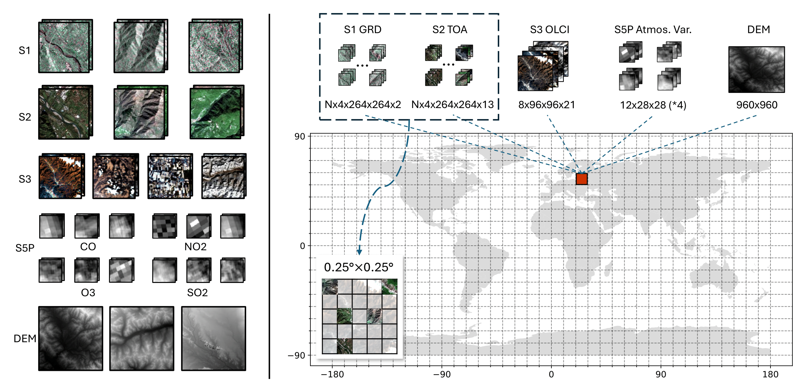

# Copernicus-Pretrain

[](https://arxiv.org/abs/2503.11849)
[](https://opensource.org/licenses/Apache-2.0)
[](https://creativecommons.org/licenses/by/4.0/)
[](https://huggingface.co/wangyi111/Copernicus-Pretrain)

This directory contains the official implementation for the pretraining dataset **Copernicus-Pretrain** in the paper "Towards a Unified Copernicus Foundation Model for Earth Vision".

## Dataset Overview



Copernicus-Pretrain is an extension of the [SSL4EO-S12](https://github.com/zhu-xlab/SSL4EO-S12) dataset to all major Sentinel missions (S1-S5P). The images are organized into ~310K regional grids (0.25°x0.25°, consistent with ERA5), densely covering the whole land surface and near-land ocean with time series from eight distinct Sentinel modalities.

|     |  Modality            | GSD   | Image size            | # Grid cells | # Patches | # Timestamps | # Total images |
|-----------|----------------------|-------|-----------------------|--------------|-----------|--------------|----------------|
| Sentinel-1 GRD  | SAR   | 10 m  | 264×264×2  | 247,723     | 1,067,267 | ~4          | 4,227,387     |
| Sentinel-2 TOA  | MS    | 10 m  | 264×264×13 | 247,723     | 1,067,267 | ~4          | 4,218,065     |
| Sentinel-3 OLCI | MS    | 300 m | 96×96×21   | 281,375     | 281,375   | ~8          | 2,189,561     |
| Sentinel-5P CO  | atmos.| 1 km  | 28×28      | 306,097     | 306,097   | 1–12        | 2,104,735     |
| Sentinel-5P NO2 | atmos.| 1 km  | 28×28      | 291,449     | 291,449   | 1–12        | 1,752,558     |
| Sentinel-5P SO2 | atmos.| 1 km  | 28×28      | 262,259     | 262,259   | 1–12        | 1,366,452     |
| Sentinel-5P O3  | atmos.| 1 km  | 28×28      | 306,218     | 306,218   | 1–12        | 2,556,631     |
| Copernicus DEM  | elevation | 30 m | 960×960   | 297,665     | 297,665   | 1           | 297,665       |
| **Copernicus-Pretrain** |  |  |  | **312,567** | **3,879,597** |  | **18,713,054** |

### Dataset Structure

The dataset is organized into regional grids in consistence with the ERA5 grid system (0.25°x0.25°), each grid being one sample unit and containing a time series of images from all eight Sentinel modalities. S3, S5P, and DEM images cover the entire grid, while S1 and S2 images are further sampled into local patches. Specifically, the raw dataset is structured as follows:

```bash
Copernicus-Pretrain # geotiff
├── Sentinel-1
│   ├── images
│   │   ├── gridId_lon_lat
│   │   │   ├── localId_lon_lat
│   │   │   │   ├── s1_fname_1.tif
│   │   │   │   ├── s1_fname_2.tif
│   │   │   │   ├── ...
│   │   │   │   ├── s1_fname_4.tif
│   │   │   ├── ...
│   |   ├── ...
├── Sentinel-2
|   ├── ... # mostly paired with S1
├── Sentinel-3
|   ├── images
│   │   ├── gridId_lon_lat
│   │   │   ├── s3_fname_1.tif
│   │   │   ├── ...
│   │   │   ├── s3_fname_8.tif
│   |   ├── ...
├── Sentinel-5P
|   ├── images
│   │   ├── CO_column_number_density
│   │   │   ├── gridId_lon_lat
│   │   │   │   ├── s5p_co_fname_1.tif
│   │   │   │   ├── ...
|   │   |   |   ├── s5p_co_fname_12.tif
│   │   │   ├── ...
│   │   ├── NO2_column_number_density
|   │   |   ├── ... # similar to CO
│   │   ├── O3_column_number_density
│   │   |   ├── ... # similar to CO
│   │   ├── SO2_column_number_density
│   │   |   ├── ... # similar to CO
├── DEM
|   ├── images
│   │   ├── gridId_lon_lat
│   │   │   ├── dem.tif
│   │   ├── ...
├── fnames_all_1m.json.gz # filenames for all 1M ERA5 grids (most is empty)
├── fnames_union_310k.json.gz # filenames for 310K grids with at least one modality
├── fnames_joint_220k.json.gz # filenames for 220K grids with all modalities
```

### Dataset Access

We provide the dataset in two formats:

- [ ] Raw format (GeoTiff): To be released soon.
- [x] Streaming format (WebDataset): This version is available on [HuggingFace](https://huggingface.co/datasets/wangyi111/Copernicus-Pretrain).

In the webdataset format of Copernicus-Pretrain, images are converted into pytorch tensors and grouped into samples. A batch of samples (~100) are packed into a small ".tar" shard for efficient streaming and distributed training. Each sample consists of 8 ".pth" tensors corresponding to 8 modalities, and one ".json" file to store the metadata. Note that ~220K grids have all modalities available (`ssl4eo_s_220k_aligned/`), while the rest ~90K grids have missing modalities (`ssl4eo_s_220k_310k_union/`).  The detailed file structure is as follows:

```bash
Copernicus-Pretrain # webdataset
├── example-000000.tar
│   ├── gridID.s1_grd.pth # Nx4x2x264x264, [local_patches,timestamps,C,H,W]
│   ├── gridID.s2_toa.pth # Nx4x2x264x264, [local_patches,timestamps,C,H,W]
│   ├── gridID.s3_olci.pth # 8x21x96x96, [timestamps,C,H,W]
│   ├── gridID.s5p_co.pth # 12x1x28x28, [timestamps,C,H,W]
│   ├── gridID.s5p_no2.pth # 12x1x28x28, [timestamps,C,H,W]
│   ├── gridID.s5p_o3.pth # 12x1x28x28, [timestamps,C,H,W]
│   ├── gridID.s5p_so2.pth # 12x1x28x28, [timestamps,C,H,W]
│   ├── gridID.dem.pth # 1x960x960, [1,H,W]
│   ├── gridID.json # grid_id, coord, date, etc.
│   ├── ...
├── example-000001.tar
│   ├── ...
│   ...
```

Auxiliary resources:

- [x] A small example subset with 100 grids (~7k images) for both formats: [HuggingFace](https://huggingface.co/datasets/wangyi111/Copernicus-Pretrain/tree/main/example_100_grids)
- [x] Json files containing image filenames of the full geotiff dataset: [HuggingFace](https://huggingface.co/datasets/wangyi111/Copernicus-Pretrain/tree/main)

## Load Dataset

Download the example subset from [HuggingFace](https://huggingface.co/datasets/wangyi111/Copernicus-Pretrain/tree/main/example_100_grids) and extract the files to the `data/` directory.

### GeoTiff format

Install `torch`, `torchvision`, `kornia`, `rasterio`, and `gzip`, and run:

```python
from data_loading.copernicuspretrain_dataset_geotiff import CopernicusPretrain

fnames_path = 'data/example_100_geotiff/fnames_100_union.json.gz'
root_dir = 'data/example_100_geotiff/'

CopernicusPretrain = CopernicusPretrain(
    fnames_path, root_dir, 
    transform_s1=None, transform_s2=None, transform_s3=None, transform_s5p=None, transform_dem=None
    )
dataloader = DataLoader(CopernicusPretrain, batch_size=1, shuffle=True, num_workers=2) # batch size can only be 1 because of varying number of images per grid

for i, (sample, meta_data) in enumerate(dataloader):
    print(meta_data)
    break
```

### WebDataset format

Install `torch` and `webdataset`, and run:

```python
from data_loading.copernicuspretrain_dataset_webdataset import CopernicusPretrain

shards_path = 'data/example_100_webdataset/example-{000000..000009}.tar'
data_size = 100
batch_size = 1

copernicus_pretrain = CopernicusPretrain(shards_path, batch_size=batch_size, num_workers=2, shuffle=10, shardshuffle=True, resampled=True)
dataloader = copernicus_pretrain.get_dataloader()

# Since we are using resampling, the dataset is infinite; set an artificial epoch size.
dataloader = dataloader.with_epoch(data_size // batch_size)
dataloader = dataloader.with_length(data_size // batch_size)


for sample in dataloader:
    sample_s1, sample_s2, sample_s3, sample_co, sample_no2, sample_o3, sample_so2, sample_dem, meta = sample
    print(meta)
    break
```

A demo notebook with more details is provided in [`data_loading/demo_dataloading.ipynb`](data_loading/demo_dataloading.ipynb).

- [ ] TODO: Add more demonstration.

## Dataset Collection

We use Google Earth Engine (GEE) to collect the raw images from the Copernicus Sentinel missions and the Copernicus DEM. The downloading and preprocessing scripts are available in the [`data_collection/`](data_collection/) directory.

- [ ] TODO: Clean/test the downloading/preprocessing scripts.

## License

This directory is licensed under the Apache License 2.0. The Copernicus-Pretrain dataset is licensed under the CC-BY-4.0 license.

## Citation

```bibtex
@misc{wang2025unifiedcopernicusfoundationmodel,
      title={Towards a Unified Copernicus Foundation Model for Earth Vision}, 
      author={Yi Wang and Zhitong Xiong and Chenying Liu and Adam J. Stewart and Thomas Dujardin and Nikolaos Ioannis Bountos and Angelos Zavras and Franziska Gerken and Ioannis Papoutsis and Laura Leal-Taixé and Xiao Xiang Zhu},
      year={2025},
      eprint={2503.11849},
      archivePrefix={arXiv},
      primaryClass={cs.CV},
      url={https://arxiv.org/abs/2503.11849}, 
}
```
