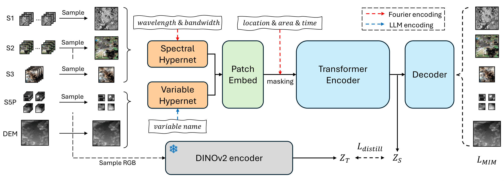

# Copernicus Foundation Model

[](https://opensource.org/licenses/Apache-2.0)
[](https://arxiv.org/abs/2503.11849)

This repository contains the official implementation of the paper "[Towards a Unified Copernicus Foundation Model for Earth Vision](https://arxiv.org/abs/2503.11849)" (ICCV 2025 oral).

<div align="center">

</div>

### Key features

- 🌍 **Copernicus-Pretrain**: A massive-scale pretraining dataset with 18.7M aligned images from all major Copernicus Sentinel missions, spanning from the Earth's surface to its atmosphere.
- 🤖 **Copernicus-FM**: A unified foundation model capable of processing any spectral or non-spectral sensor modality using extended dynamic hypernetworks and flexible metadata encoding.
- 📊 **Copernicus-Bench**: A systematic evaluation benchmark with 15 hierarchical downstream tasks ranging from preprocessing to specialized applications for each Sentinel mission.
- 🌐 **Copernicus-Embed-025deg**: An embedding dataset that provides a global embedding map (721x1440x768) at 0.25°, integrating various sources of satellite observations at an extremely high compression ratio.

## Copernicus-Pretrain

Copernicus-Pretrain is an extension of the [SSL4EO-S12](https://github.com/zhu-xlab/SSL4EO-S12) dataset to all major Sentinel missions (S1-S5P). The images are organized into ~310K regional grids (0.25°x0.25°, consistent with ERA5), densely covering the whole land surface and near-land ocean with time series from eight distinct Sentinel modalities.


🔽 **Dataset access**:

- Raw format (GeoTiff): This version is available on [HuggingFace](https://huggingface.co/datasets/wangyi111/Copernicus-Pretrain).
- Streaming format (WebDataset): This version is available on [HuggingFace](https://huggingface.co/datasets/wangyi111/Copernicus-Pretrain).

📂 **Further details:** [`Copernicus-Pretrain/`](Copernicus-Pretrain/)


## Copernicus-FM

Copernicus-FM is an extension of the [DOFA](https://github.com/zhu-xlab/DOFA) foundation model that can process any spectral or non-spectral sensor modality using extended dynamic hypernetworks and flexible metadata encoding. The model is pretrained on the Copernicus-Pretrain dataset with masked image modeling and continual distillation.



🔽 **Weights access**: The model weights are available on [HuggingFace](https://huggingface.co/wangyi111/Copernicus-FM).

📂 **Further details:** [`Copernicus-FM/`](Copernicus-FM/)

## Copernicus-Bench

Copernicus-Bench is a systematic evaluation benchmark with 15 hierarchical downstream datasets spread into three level of applications covering all major Sentinel missions (S1,2,3,5P). Among them, 9 are derived from existing datasets, and 6 are newly curated.

| Level | Name           | Modality | Task                                | Source                                                                               |
|-------|----------------|----------|-------------------------------------|--------------------------------------------------------------------------------------|
| L1    | Cloud-S2       | S2 TOA   | segmentation (cloud)                | [CloudSEN12](https://huggingface.co/datasets/tacofoundation/cloudsen12)              |
| L1    | Cloud-S3       | S3 OLCI  | segmentation (cloud)                | new                                                                                  |
| L2    | EuroSAT-S1     | S1 GRD   | classification (LULC)               | [EuroSAT-SAR](https://huggingface.co/datasets/wangyi111/EuroSAT-SAR)                 |
| L2    | EuroSAT-S2     | S2 TOA   | classification (LULC)               | [EuroSAT](https://github.com/phelber/EuroSAT)                                        |
| L2    | BigEarthNet-S1 | S1 GRD   | classification (LULC)               | [BigEarthNet v2.0](https://bigearth.net/)                                            |
| L2    | BigEarthNet-S2 | S2 SR    | classification (LULC)               | [BigEarthNet v2.0](https://bigearth.net/)                                            |
| L2    | LC100Cls-S3    | S3 OLCI  | classification (LULC)               | new                                                                                  |
| L2    | DFC2020-S1     | S1 GRD   | segmentation (LULC)                 | [DFC2020](https://ieee-dataport.org/competitions/2020-ieee-grss-data-fusion-contest) |
| L2    | DFC2020-S2     | S2 TOA   | segmentation (LULC)                 | [DFC2020](https://ieee-dataport.org/competitions/2020-ieee-grss-data-fusion-contest) |
| L2    | LC100Seg-S3    | S3 OLCI  | segmentation (LULC)                 | new                                                                                  |
| L3    | Flood-S1       | S1 GRD   | change detection (flood)            | [Kuro Siwo](https://github.com/Orion-AI-Lab/KuroSiwo)                                |
| L3    | LCZ-S2         | S2 TOA   | classification (local climate zone) | [So2Sat LCZ42](https://github.com/zhu-xlab/So2Sat-LCZ42)                             |
| L3    | Biomass-S3     | S3 OLCI  | regression (biomass)                | new                                                                                  |
| L3    | AQ-NO2-S5P     | S5P NO2  | regression (air quality)            | new                                                                                  |
| L3    | AQ-O3-S5P      | S5P O3   | regression (air quality)            | new                                                                                  |

🔽 **Dataset access**: The benchmark datasets are available on [HuggingFace](https://huggingface.co/datasets/wangyi111/Copernicus-Bench).

📂 **Further details:** [`Copernicus-Bench/`](Copernicus-Bench/)

## Copernicus-Embed-025deg

Copernicus-Embed-025deg is an embedding dataset that provides a global embedding map (721x1440x768) at 0.25°, integrating various sources of satellite observations at an extremely high compression ratio. It has been shown to be beneficial for linking Earth's surface to the atmosphere, unlocking new possibilities in the development of weather/climate foundation models.


🔽 **Dataset access**: The embedding datasets are available on [HuggingFace](https://huggingface.co/datasets/wangyi111/Copernicus-Embed-025deg).

📂 **Further details:** [`Copernicus-Embed-025deg/`](Copernicus-Embed-025deg/)

## License

This repo is licensed under the Apache License 2.0. The Copernicus-Pretrain dataset, the newly-curated datasets in Copernicus-Bench, and the pretrained weights of Copernicus-FM are licensed under the CC-BY-4.0 license.

## Citation

```bibtex
@misc{wang2025unifiedcopernicusfoundationmodel,
      title={Towards a Unified Copernicus Foundation Model for Earth Vision}, 
      author={Yi Wang and Zhitong Xiong and Chenying Liu and Adam J. Stewart and Thomas Dujardin and Nikolaos Ioannis Bountos and Angelos Zavras and Franziska Gerken and Ioannis Papoutsis and Laura Leal-Taixé and Xiao Xiang Zhu},
      year={2025},
      eprint={2503.11849},
      archivePrefix={arXiv},
      primaryClass={cs.CV},
      url={https://arxiv.org/abs/2503.11849}, 
}
```
